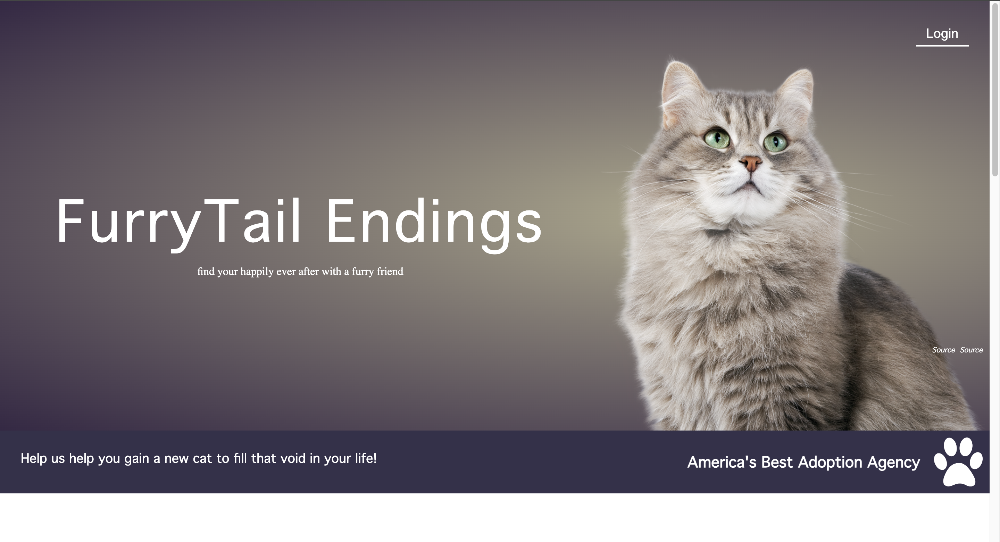
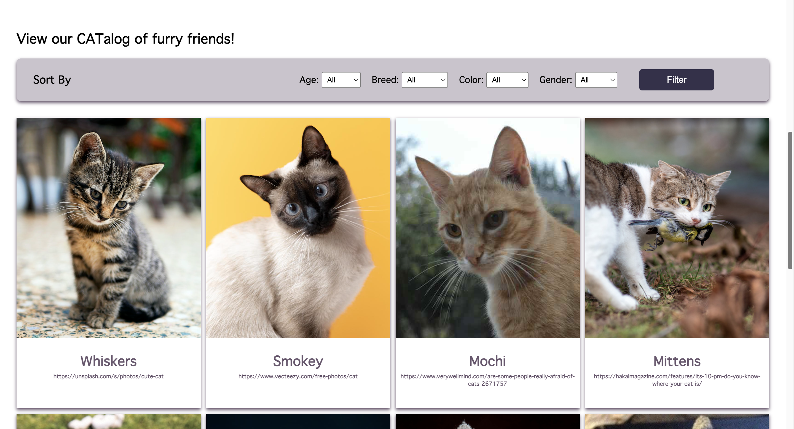
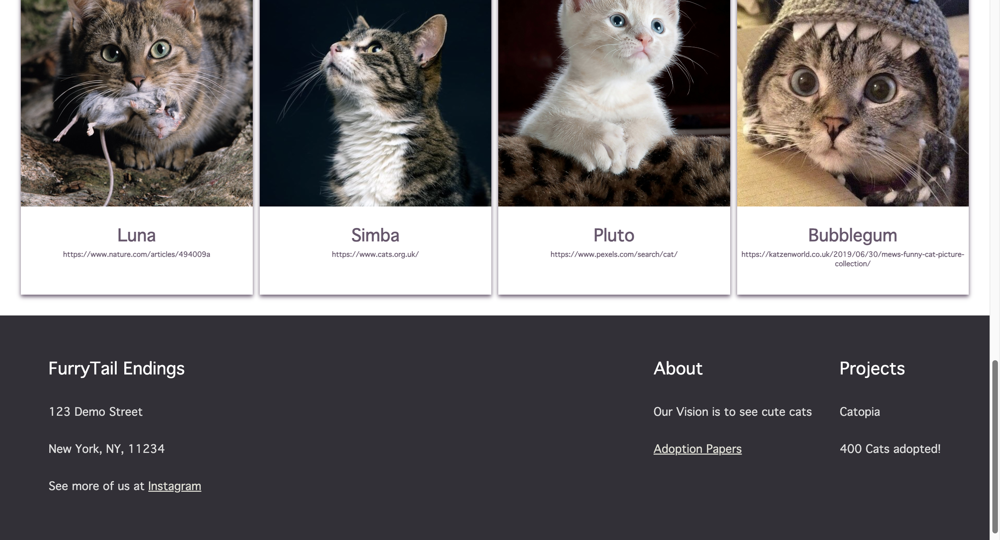
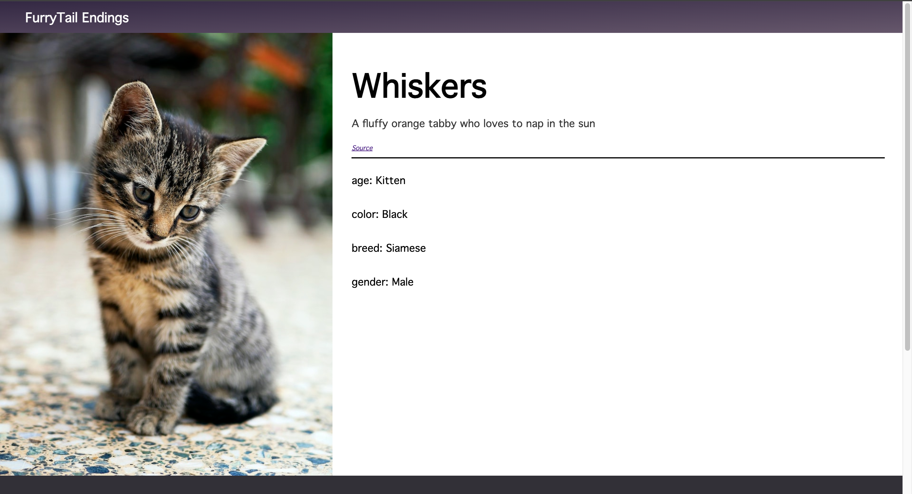
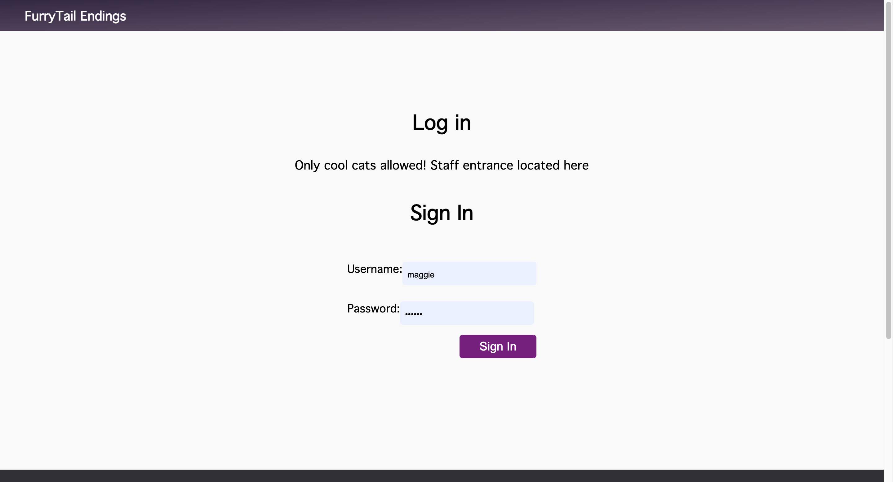
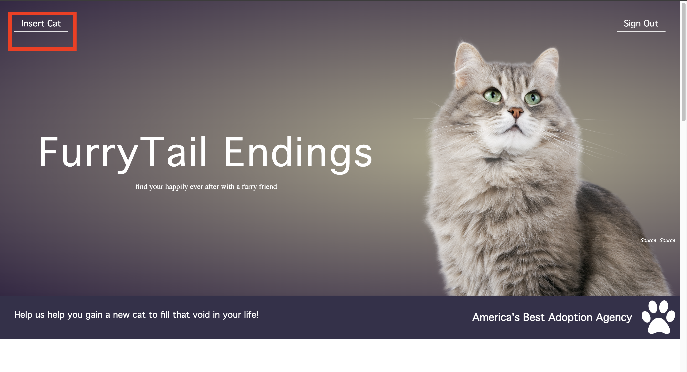
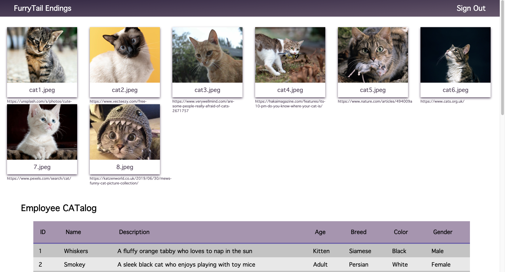
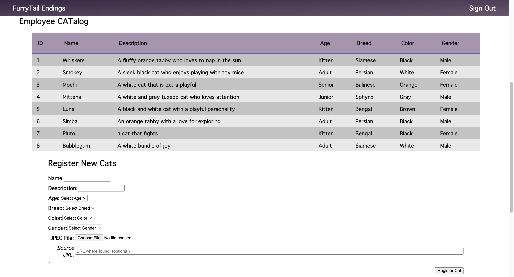

# Cat-Adoption-Website
____ 

## Description
This website is meant to displayed on a desktop. It is a cat adoption website that has features such as a filter, gallary, details page, log-in authenitication, and an addition form that adds new data to the database in the backend. 

## Sneak Peak into the Website 

### User Flow
The audience begins on the home page where they will see the Login at the top, a filter, and a gallery of all available cats for adoption

They can click into the entries and look at more details on their individual pages

For **admin access** user will go back to the home screen and click "Log in" at the top right of the screen. They will enter the admin credientials which are located near the bottom of this README. Sign in and a new button will be available on the home screen

Navigate to the home screen and click the top left "insert cat"

Here you will see a gallery of the current cats in the database and be allowed to insert new cats for adoption into the database

## Instructions 
1. open the website on codespace
2. Install PHP extension if you don't have it 
3. Install all other recommended extensions in .vscode/extensions.json
4. Run and Start debugging

### Login Information Admin 

**Username**: maggie

**Password**: monkey

## Acknowledgements
This project was done under INFO 2300 "Intermediate Programming and Design". I would like to acknowledge my professor, Kyle Harms, for creating the resources that helped me create this project. 