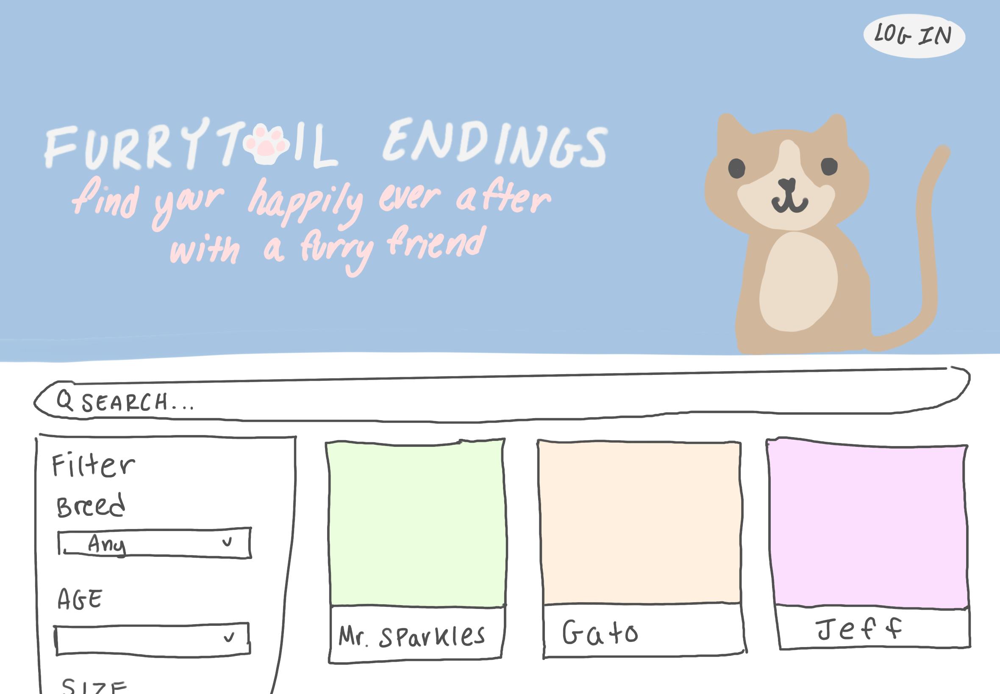
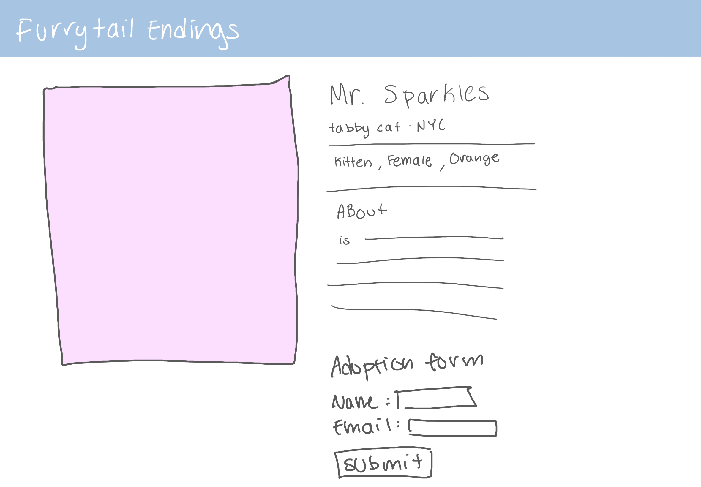
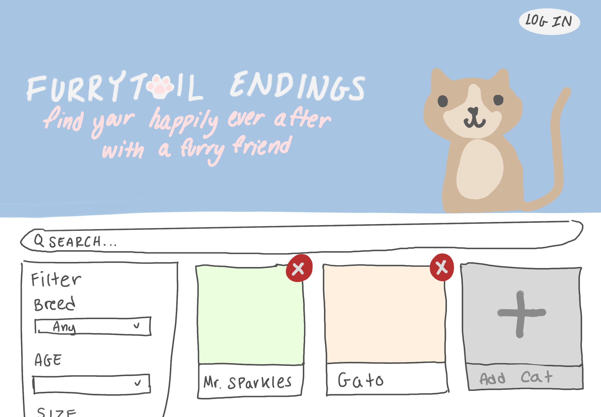

# Project 3: Design Journey

**For each milestone, complete only the sections that are labeled with that milestone.** Refine all sections before the final submission.

You are graded on your design process. If you later need to update your plan, **do not delete the original plan, rather leave it in place and append your new plan _below_ the original.** Then explain why you are changing your plan. Any time you update your plan, you're documenting your design process!

**Replace ALL _TODOs_ with your work.** (There should be no TODOs in the final submission.)

Be clear and concise in your writing. Bullets points are encouraged.

**Everything, including images, must be visible in _Markdown: Open Preview_.** If it's not visible in the Markdown preview, then we can't grade it. We also can't give you partial credit either. **Please make sure your design journey should is easy to read for the grader;** in Markdown preview the question _and_ answer should have a blank line between them.


## Design Plan (Milestone 1)

**Make the case for your decisions using concepts from class, as well as other design principles, theories, examples, and cases from outside of class (includes the design prerequisite for this course).**

You can use bullet points and lists, or full paragraphs, or a combo, whichever is appropriate. The writing should be solid draft quality.


### Catalog (Milestone 1)
> What will your catalog website be about? (1 sentence)

My website will be a site on adopting cats.


### _Consumer_ Audience (Milestone 1)
> Briefly explain your site's _consumer_ audience. Your audience should be specific, but not arbitrarily specific. (1 sentence)
> Justify why this audience is a **cohesive** group. (1-2 sentences)

My sites consumers will be animal lovers, families, cat ladies, etc. They are looking to find a cat that will be right for their family.

This is a cohesive audience because they all are coming the site for the same purpose. They want a site where they can explore different types, colors, or breed of cats. My site will allow them to do that and adopt them.


### _Consumer_ Audience Goals (Milestone 1)
> Document your _consumer_ audience's goals for using this catalog website.
> List each goal below. There is no specific number of goals required for this, but you need enough to do the job (Hint: It's more than 1. But probably not more than 3.)
> **Hint:** Users will be able to view all entries in the catalog and insert new entries into the catalog. The audience's goals should probably relate to these activities.

Goal 1: Explore different cat varieties

- **Design Ideas and Choices** _How will you meet those goals in your design?_
  - I will make it easy to filter and look up certain cats. I also want to implement a search system that will allow them to search up cat breeds or a certain cat they have seen before.
- **Rationale & Additional Notes** _Justify your decisions; additional notes._
  - this will make it easier for my audience to explore the website. There are many different type of cats, there needs to be a filtering system in case the audience has a specific cat in mind.

Goal 2: Ability to adopt cat

- **Design Ideas and Choices** _How will you meet those goals in your design?_
  - I will make a detailed page on each cat
  - I will list there name, age, breed, etc
  - I will also make a submit form button that will allow them to adopt the cat. They will recieve a submission email/message after they adopt the cat
- **Rationale & Additional Notes** _Justify your decisions; additional notes._
  - If the audience want to learn more about the cat, there should be a more in depth page on the cat. There should also be an adoption button so they can actually adopt the cat.


### _Consumer_ Audience Device (Milestone 1)
> How will your _consumer_ audience access this website? From a narrow (phone) or wide (laptop) device?
> Justify your decision. (1 sentence)

Laptop

I will use a laptop so the audience can better look at the cats. Having a mobile screen will make it hard for the cats to all display together.


### _Consumer_ Persona (Milestone 1)
> Use the goals you identified above to develop a persona of your site's _consumer_ audience.
> Your persona must have a name and a face. The face can be a photo of a face or a drawing, etc.


Bobbia

**Factors that Influence Behavior:**

- cost of cat
- what type of cat there is
- if cat is potty trained
- age of cat
- haelth of cat

**Goals:**

- Bobbia just started family, she wants to get a cat for her newborn baby so they can be besties in the future.
- Wants a kitten so it lives a long life
- Wants orange tabby cat
- Healthy cat

**Obstacles:**

- has a 200 dollar budget
- wants to see her options

**Desires:**

- want a lifelong bestfriend for her daughter
- Wants a cute orange cat that is kid friendly


### _Administrator_ Audience (Milestone 1)
> Briefly explain your site's _administrator_ audience. Your audience should be specific, but not arbitrarily specific. (1 sentence)
> Justify why this audience is a **cohesive** group. (1-2 sentences)

The adminstrators audience will be people who run the adoption agency, Such as employees who need to update the website when there is a new cat up for adoption.

this is a cohesive audience because they all have the same goals. They want to update the catalog and edit the descriptions for each of the cats.


### _Administrator_ Audience Goals (Milestone 1)
> Document your _administrator_ audience's goals for using this catalog website.
> List each goal below. There is no specific number of goals required for this, but you need enough to do the job (Hint: It's more than 1. But probably not more than 3.)
> **Hint:** Users will be able to view all entries in the catalog and insert new entries into the catalog. The audience's goals should probably relate to these activities.

Goal 1: Update information on the website

- **Design Ideas and Choices** _How will you meet those goals in your design?_
  - I will add an option where the employee can update the description of cats
- **Rationale & Additional Notes** _Justify your decisions; additional notes._
  - This will be useful in case wrong information is uploaded about one of the cats. They have to be able to quickly edit the website.

Goal 2: Add/remove a cat to the system

- **Design Ideas and Choices** _How will you meet those goals in your design?_
  - There will a add/delete button for the cats.
- **Rationale & Additional Notes** _Justify your decisions; additional notes._
  - This will make it easier for the administer to add/remove cats since there's an easily accessible button.


### _Administrator_ Persona (Milestone 1)
> Use the goals you identified above to develop a persona of your site's _administrator_ audience.
> Your persona must have a name and a face. The face can be a photo of a face or a drawing, etc.


Robbia

**Factors that Influence Behavior:**

- how easy it is to update cat info
- they want to go home quickly, so they want to finish work quickly

**Goals:**

- finish job on time
- update the cat information
- add/remove cats to the website

**Obstacles:**

- They have a time constraint. They could only work for so long during the day
- Is an old man ignorant to technology. Websites have to be very easy and simple to use for him to understand

**Desires:**

- Ability to add/remove cats easily
- Ability to update website
- Log in to his account easily


### Catalog Data (Milestone 1)
> Using your personas, identify the data you need to include in the catalog for your site's audiences.
> Justify why this data aligns with your persona's goals. (1 sentence)

- cat pictures
- Cat names
- cat breed
- cat age
- cat description/characteristics
- Cat health
- cat gender
- How far away they are

This aligns with Bobbias goals because they need all this information if they want to adopt a cat. Some users have certain preferences, so the website needs to offer a lot of information.


### Site Design (Milestone 1)
> Design your catalog website to address the goals of your personas.
> Sketch your site's design:
>
> - These are **design** sketches, not _planning_ sketches.
> - Use text in the sketches to help us understand your design.
> - Where the content of the text is unimportant, you may use squiggly lines for text.
> - **Do not label HTML elements or annotate CSS classes.** This is not a planning sketch.
>
> Provide a brief explanation _underneath_ each sketch. (1 sentence)
> **Refer to your persona by name in each explanation.**


Name of website will be "Furrytail Endings", It will be captioned "find your happily ever after with a furry frined". It will be cute and display many pastel colors. I wanted it to be friendly and comfortable yet professional

Information on the cat w images. will have a form at the bottom to adopt the cat.

Button to remove and add cat. Once you click them, you will be linked to a form on what cat to upload.


I changed my design slightly, I decided to move the filter since there were only 4 adjustable tags. I opted for a horizontal bar since it aligns with industy standards. Additionally I made my background purple. However these are minor changes where I just changed the color and moved some functionality around.


### Catalog Design Patterns (Milestone 1)
> Explain how you used design patterns in your site's design. (1-2 sentences)

I implemented common design patterns while giving it my own creative touch. I put the title at the very top. Additionally, traditonally, log-in button are on the top right. I also put a search bar at the top and a filter on the left side since it is an industry standard. I also made sure everything was aligned and followed the users eyes.


## Implementation Plan (Milestone 1, Milestone 2, Milestone 3, Final Submission)

### Database Schema (Milestone 1)
> Plan the structure of your database. You may use words or a picture.
> A bulleted list is probably the simplest way to do this.
> Make sure you include constraints for each field.

Table: cats

- id  INT (NN, A, PK, U),
- name TEXT (NN),
- desciption TEXT ()

Table: tag
- id
- type
- value

TABLe : cat tags
- id
- catid
- tagid


### Database Query Plan (Milestone 1, Milestone 2, Milestone 3, Final Submission)
> Plan _all_ of your database queries.
> You may use natural language, pseudocode, or SQL.

```
make feedback values, if form submitted, send submission response, open sql.
```

```
$sql_select_clause = "SELECT cats.breed_id AS 'cats.breed_id', breeds.breed_type AS 'breeds.breed_type', cats.cat_name AS 'cats.cat_name', cats.age AS 'cats.age', cats.description AS 'cats.description'
FROM cats INNER JOIN breed ON (cats.breed_id = breeds.id)";
$sql_order_clause = '';

$sql_select_query = $sql_select_clause . $sql_order_clause . ';';
$records = exec_sql_query($db, $sql_select_query)->fetchAll();
```

```
$sql_select_clause = "SELECT cats.color_id AS 'cats.color_id', colors.color_type AS 'colors.color_type', cats.cat_name AS 'cats.cat_name', cats.age AS 'cats.age', cats.description AS 'cats.description'
FROM cats INNER JOIN colors ON (cats.color_id = colors.id)";
$sql_order_clause = '';
```

```
$sql_select_clause = "SELECT cats.gender_id AS 'cats.gender_id', genders.gender_type AS 'genders.gender_type', cats.cat_name AS 'cats.cat_name', cats.age AS 'cats.age', cats.description AS 'cats.description'
FROM cats INNER JOIN genders ON (cats.gender_id = genders.id)";
$sql_order_clause = '';
```

```
$sort_param['age'] = $_GET['age_tag'] ?? NULL; // untrusted
$sort_param['breed'] = $_GET['age_breed'] ?? NULL; // untrusted
$sort_param['color'] = $_GET['age_color'] ?? NULL; // untrusted
$sort_param['gender'] = $_GET['age_gender'] ?? NULL; // untrusted


$sql_select_clause = "SELECT cats.id, cats.cat_name, cats.cat_description
,age_tags.tag AS age, color_tags.tag AS color, breed_tags.tag AS breed, gender_tags.tag AS gender
FROM cats
JOIN cats_tags ON cats.id = cats_tags.cat_id
JOIN age_tags ON cats_tags.age_tag_id = age_tags.id
JOIN breed_tags ON cats_tags.breed_tag_id = breed_tags.id
JOIN color_tags ON cats_tags.color_tag_id = color_tags.id
JOIN gender_tags ON cats_tags.gender_tag_id = gender_tags.id";


$age_tags = exec_sql_query($db, "SELECT tag FROM age_tags")->fetchAll(PDO::FETCH_COLUMN);
$breed_tags = exec_sql_query($db, "SELECT tag FROM breed_tags")->fetchAll(PDO::FETCH_COLUMN);
$color_tags = exec_sql_query($db, "SELECT tag FROM color_tags")->fetchAll(PDO::FETCH_COLUMN);
$gender_tags = exec_sql_query($db, "SELECT tag FROM gender_tags")->fetchAll(PDO::FETCH_COLUMN);

<form method="get">
        <label for="age-tag">Age:</label>
        <select name="age_tag" id="age-tag" class="<?php echo $sort_css_classes['age']; ?>">
          <option value="">All</option>
          <?php foreach ($age_tags as $tag) { ?>
            <option value="<?php echo htmlentities($tag); ?>" <?php echo ($sort_param['age'] == $tag) ? 'selected' : ''; ?>>
              <?php echo htmlentities($tag); ?>
            </option>
          <?php } ?>
        </select>
```

```

define("MAX_FILE_SIZE", 1000000);

$upload_feedback = array(
  'general_error' => False,
  'too_large' => False
);

// upload fields
$upload_source = NULL;
$upload_file_name = NULL;
$upload_file_ext = NULL;


if (isset($_POST["upload"])) {

  $upload_source = trim($_POST['source']); // untrusted
  if (empty($upload_source)) {
    $upload_source = NULL;
  }...

  if ($form_valid) { // step 4
    // insert upload into DB
    $result = exec_sql_query(
      $db,
      "INSERT INTO clipart (file_name, file_ext, source) VALUES (:file_name, :file_ext, :source)",
      array(
        ':file_name' => $upload_file_name,
        ':file_ext' => $upload_file_ext,
        ':source' => $upload_source
      )
    );

```

## Complete & Polished Website (Final Submission)

### Accessibility Audit (Final Submission)
> Tell us what issues you discovered during your accessibility audit.
> What do you do to improve the accessibility of your site?

There were some contrast errors that I had to fix, some text were too light and it would be hard to see against a white background


### Self-Reflection (Final Submission)
> Reflect on what you learned during this assignment. How have you improved from Projects 1 and 2?

I have learned a lot on this project I was definitely challenged. I struggled to implement the form since I couldn't figure out how to submit multiple tags under a singular cat. Overall this project was a great learning opportunitity. I have improved in my css and my overall programming skills.


> Take some time here to reflect on how much you've learned since you started this class. It's often easy to ignore our own progress. Take a moment and think about your accomplishments in this class. Hopefully you'll recognize that you've accomplished a lot and that you should be very proud of those accomplishments! (1-3 sentences)

I have learned so much from this class. This class has definitely made me more ready to create more dynamic and complex websites later on,


### Collaborators (Final Submission)
> List any persons you collaborated with on this project.

none


### Reference Resources (Final Submission)
> Please cite any external resources you referenced in the creation of your project.
> (i.e. W3Schools, StackOverflow, Mozilla, etc.)

W3Schools documentation: https://www.w3schools.com/css/css_form.asp


### Grading: User Accounts (Final Submission)
> The graders will need to log in to your website.
> Please provide the usernames and passwords.

**Administrator User:**

- Username: maggie
- Password: monkey

**Consumer User:**

doesn't need consumer log in

**Note:** Not all websites will support consumer log in. If your website doesn't, say so.


### Grading: Step-by-Step Instructions (Final Submission)
> Write step-by-step instructions for the graders.
> The project if very hard to grade if we don't understand how your site works.
> For example, you must log in before you can delete.
> For each set of instructions, assume the grader is starting from /

_View all entries:_

1. Start the website on the home page.
2. If you are on another page, the header should have the name of the website, click that and it will bring you back to the home page

_View all entries for a tag:_

1. On the view all entries page there should be a horizontal bar that says sort by
2. click multiple tags, or just one tag and press the filter button
3. There are only 6 cats so only some fit the categories

_View a single entry's details:_

1. Click on the box that the cat shows up on on the home page

_How to insert and upload a new entry:_

1. You need to log in to the website by clicking the log in button on the home page
2. Type in your log info and then go back to the home page by clicking the title of the website in the header
3. click the insert cat button at the top left
4. fill out the form and insert a new entry

_How to delete an entry:_

1. none
